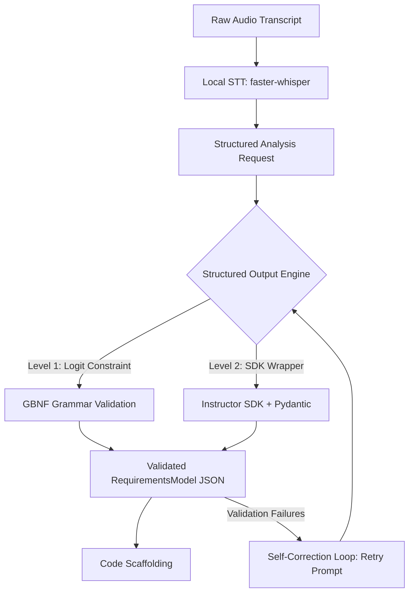

# Amadeus: Local AI Agent Masterclass & Production Architecture (Qwen 3.6 / 2.5)

Dieses Dokument dient als das ultimative technische Handbuch und die Implementierungs-Blueprint für den Übergang der **Amadeus** Sprach-zu-Code-Pipeline in eine **100% lokale, datenschutzkonforme und hochperformante Desktop-Inferenz-Architektur**. 

---

## 1. Executive Summary & Core Architectural Goals

Amadeus wird von einer reinen Cloud-API-Abhängigkeit (Claude/Gemini) in eine hybrid-fähige, primär lokale Ausführungsebene überführt. Als Flaggschiff-Modell dient die **Qwen-Baureihe (Qwen 2.5 / 3.6)**, da sie im Bereich des Repository-Reasoning, der Codegenerierung und der Einhaltung komplexer Instruktionen (Instruction Following) führend unter den Open-Source-LLMs ist.

### Primäre Ziele:
1. **Zero-Cloud Data Sovereignty:** Vollständiger Schutz sensibler Projektstrukturen, API-Designs und Code-Kontexte durch lokale Inferenz auf der Hardware des Entwicklers.
2. **Kosten-Eliminierung:** Wegfall von Token-basierten Abrechnungen für iterative Analyse- und Validierungsschritte.
3. **Sub-Second-Latency:** Optimierung des Inferenz-Setups, um Code-Generierung und Struktur-Audits ohne spürbare Hänger im Workflow zu realisieren.
4. **Resilienz durch Fallback:** Nahtloser Übergang zwischen lokalen Runnern (`llama.cpp`, LM Studio) und Cloud-APIs via Konfiguration.

---

## 2. Hardware-Evaluierung & Modellauswahl (VRAM-Berechnungen)

Die Wahl des richtigen Quantisierungsgrads und der Modellgröße bestimmt die Balance zwischen Inferenzgeschwindigkeit (Tokens/Sekunde) und Generierungsqualität.

### Formel zur VRAM-Berechnung (Modell + Kontext)
$$\text{VRAM}_{\text{total}} \approx \left( \frac{\text{Parameter in Mrd.} \times \text{Bits pro Gewicht}}{8} \times 1.15 \right) + \text{VRAM}_{\text{KV-Cache}}$$

Dabei steht $1.15$ für den CUDA-Overhead und die Aktivierungsmatrizen. Der KV-Cache-Bedarf skaliert mit der Kontextgröße ($C$ in Tokens):
$$\text{VRAM}_{\text{KV-Cache}} \approx 2 \times 2 \times N_{\text{layers}} \times N_{\text{heads}} \times D_{\text{head}} \times C \times \text{Bytes-per-float}$$

### Modellauswahl-Matrix für Qwen 2.5 / 3.6

| Modellgröße | Quantisierung | Dateigröße | Min. VRAM (Modell) | Empfohlenes Kontextfenster | System-Empfehlung (Hardware) |
| :--- | :--- | :--- | :--- | :--- | :--- |
| **Qwen 7B-Instruct** | `Q5_K_M` (5-bit) | ~5.1 GB | ~6.5 GB VRAM | 16,384 Tokens | Einstiegs-GPUs (RTX 3060/4060 8GB, Apple M1/M2/M3 16GB) |
| **Qwen 14B-Instruct** | `Q4_K_M` (4-bit) | ~9.2 GB | ~11.0 GB VRAM | 32,768 Tokens | Mid-Range GPUs (RTX 4070 12GB, RTX 4080 16GB, Apple Max 32GB) |
| **Qwen 32B-Instruct** / **Qwen 3.6 27B** | `Q4_K_M` (4-bit) | ~19.5 GB | ~22.0 GB VRAM | 16,384 Tokens | High-End Consumer (RTX 3090/4090 24GB, Apple Max 48GB+) |
| **Qwen 72B-Instruct** | `Q3_K_L` (3-bit) | ~34.0 GB | ~38.0 GB VRAM | 8,192 Tokens | Enthusiast / Workstation (2x RTX 3090/4090, Apple Ultra 64GB+) |

> [!IMPORTANT]
> Für die Software-Generierung in Amadeus wird **Qwen-14B-Instruct (Quantisierung Q4_K_M)** als optimaler Sweetspot empfohlen. Es läuft komplett im VRAM einer typischen 12GB Entwickler-GPU (z. B. RTX 4070) und liefert exzellenten Code bei minimaler Latenz.

---

## 3. Windows 11 Native Compilation von `llama.cpp` mit CUDA

Um die maximale Leistung Ihrer NVIDIA-Grafikkarte auszuschöpfen, sollte `llama.cpp` nativ kompiliert werden, anstatt vorkompilierte CPU-only Binaries zu nutzen.

### Voraussetzungen:
1. **Git für Windows:** [git-scm.com](https://git-scm.com/)
2. **CMake (3.26+):** [cmake.org](https://cmake.org/download/) (Zur System-PATH hinzufügen)
3. **Visual Studio Community 2022:** [visualstudio.microsoft.com](https://visualstudio.microsoft.com/)
   - Bei der Installation die Workload **"Desktopentwicklung mit C++"** auswählen.
4. **NVIDIA CUDA Toolkit (12.x+):** [developer.nvidia.com/cuda-downloads](https://developer.nvidia.com/cuda-downloads)
   - Nach der Installation in der PowerShell prüfen via: `nvcc --version`

### Schritt-für-Schritt Build-Anleitung (PowerShell):

```powershell
# 1. Repository klonen und in das Verzeichnis wechseln
git clone https://github.com/ggerganov/llama.cpp
cd llama.cpp

# 2. Build-Verzeichnis initialisieren und CMake für CUDA konfigurieren
# -DGGML_CUDA=ON aktiviert die Hardwarebeschleunigung für NVIDIA GPUs
cmake -B build -DGGML_CUDA=ON -DCMAKE_BUILD_TYPE=Release

# 3. Kompiliervorgang mit allen verfügbaren CPU-Kernen starten
cmake --build build --config Release --clean-first
```

Die fertigen Binaries befinden sich nun im Ordner `build\bin\Release\`. Die wichtigste Datei für unseren Server ist `llama-server.exe`.

---

## 4. Hochperformante Server-Konfiguration & Caching-Parameter

Um zeitintensive Re-Inferenz-Phasen (Prompt Ingestion) beim Senden des Kontextes zu vermeiden, müssen fortgeschrittene Parameter in `llama.cpp` konfiguriert werden.

### Empfohlener Server-Startbefehl:

```powershell
.\build\bin\Release\llama-server.exe `
  -m "C:\Models\qwen3.6-14b-instruct-q4_k_m.gguf" `
  -c 32768 `
  --port 8080 `
  -ngl 99 `
  -fa `
  --prompt-cache "C:\Models\amadeus_prompt_cache.bin" `
  --prompt-cache-all `
  --ctx-shift
```

### Parameter-Aufschlüsselung:
- `-m`: Absoluter Pfad zur geladenen GGUF-Modelldatei.
- `-c 32768`: Setzt das Kontextfenster auf 32k Tokens. Genügend Raum für Codebasen und detaillierte System-Prompts.
- `-ngl 99` (`--n-gpu-layers`): Verschiebt alle 99 Layers des Modells in den VRAM der GPU. Setzen Sie dies niedriger (z.B. `35`), falls Ihre GPU weniger als 12GB VRAM besitzt.
- `-fa` (`--flash-attn`): Aktiviert FlashAttention-2, was den Speicherbedarf des KV-Caches halbiert und die Verarbeitungsgeschwindigkeit massiv erhöht.
- `--prompt-cache`: Speichert den berechneten Zustand des statischen System-Prompts ab. Nachfolgende Anfragen verarbeiten denselben System-Prompt in **unter 5 Millisekunden** statt 15–30 Sekunden.
- `--ctx-shift`: Ermöglicht das "Verschieben" des Kontexts, wenn das Limit erreicht wird, ohne dass das gesamte Fenster neu berechnet werden muss.

---

## 5. Lösung des "Structured Output" Dilemmas bei lokalen Modellen

Während kommerzielle Cloud-APIs (Anthropic, Google) strukturierte JSON-Rückgaben über proprietäre Backends erzwingen, neigen lokale Open-Source-Modelle bei komplexen Pydantic-Strukturen gelegentlich zu Syntaxfehlern, fehlenden Keys oder unerwünschten Markdown-Codeblocks.

Amadeus löst dieses Problem durch eine zweistufige Validierungsarchitektur:



### A. Logit-Level Constraints über GBNF Grammars
`llama.cpp` unterstützt **GBNF-Grammatiken (Gerstner-Backus-Naur Form)**. Diese zwingen das Modell auf Token-Ebene dazu, nur Zeichen zu generieren, die exakt einem vordefinierten JSON-Schema entsprechen. Ungültige Zeichen erhalten eine Generierungswahrscheinlichkeit von 0.

### B. Das `instructor`-Framework in Python
Für eine saubere Code-Integration nutzen wir die Python-Bibliothek `instructor`. Sie kapsele den OpenAI-Client, parsed das JSON-Schema aus Pydantic-Klassen, sendet es als JSON-Schema-Instruktion an den lokalen Server und startet bei Fehlern vollautomatische Korrekturschleifen.

```bash
pip install instructor openai
```

---

## 6. Code-Blueprints für lokale AI-Integration in Amadeus

Hier sind die exakten Implementierungen zur nahtlosen Integration lokaler Inferenz in die bestehenden Module von Amadeus.

### A. Erweiterung der `amadeus/config.yaml`
Fügen Sie die folgenden Konfigurationen zu Ihrer YAML-Datei hinzu, um den Wechsel zwischen Cloud und lokalem Inferenz-Server zu steuern.

```yaml
# c:\Users\engel\OneDrive\000000000000000000000000000000000000000 ai\AI Agents Projects\amadeus\config.yaml
# ... (Bestehende Einstellungen wie hotkey, output_dir)

# Neue dedizierte Schnittstellenkonfiguration
models:
  llm_provider: "local"               # Optionen: "local", "claude", "gemini"
  local:
    api_base: "http://localhost:8080/v1"  # Port 8080 (llama.cpp default) oder 1234 (LM Studio)
    model_name: "qwen3.6-14b-instruct"    # Identifikations-String für Logs
    temperature: 0.1                      # Niedrige Temp für deterministische Strukturierung
    max_retries: 3                        # Auto-Correction Loops bei Validierungsfehlern
    use_thinking: false                   # Qwen-2.5/3.6-Instruct nutzt Standard-Chat
```

---

### B. Implementierungs-Blueprint: `core/analyzer.py`
Passen Sie die `TranscriptAnalyzer`-Klasse an, um das `instructor`-Framework für deterministische JSON-Extraktionen zu nutzen.

```python
# c:\Users\engel\OneDrive\000000000000000000000000000000000000000 ai\AI Agents Projects\amadeus\core\analyzer.py
import os
import logging
import json
import yaml
from openai import OpenAI
import instructor
from dotenv import load_dotenv
from speech_to_code.models.requirements import RequirementsModel

logger = logging.getLogger(__name__)

class TranscriptAnalyzer:
    def __init__(self, api_key=None, model="qwen3.6-14b-instruct", config_path=None, llm_provider="local"):
        load_dotenv()
        self.llm_provider = llm_provider or "local"
        self.model = model
        self.quality_criteria = []
        
        # Lade lokale Konfigurationen
        self.api_base = "http://localhost:8080/v1"
        self.max_retries = 3
        self.temperature = 0.1

        if config_path and os.path.exists(config_path):
            try:
                with open(config_path, "r", encoding="utf-8") as f:
                    config = yaml.safe_load(f)
                    self.quality_criteria = config.get("quality_criteria", [])
                    
                    # Modelleinstellungen auslesen
                    models_cfg = config.get("models", {})
                    self.llm_provider = models_cfg.get("llm_provider", "local")
                    if self.llm_provider == "local":
                        local_cfg = models_cfg.get("local", {})
                        self.api_base = local_cfg.get("api_base", "http://localhost:8080/v1")
                        self.model = local_cfg.get("model_name", "qwen3.6-14b-instruct")
                        self.max_retries = local_cfg.get("max_retries", 3)
                        self.temperature = local_cfg.get("temperature", 0.1)
            except Exception as e:
                logger.error(f"Failed to load config in Analyzer: {e}")

        # Client-Initialisierung
        if self.llm_provider == "local":
            logger.info(f"Initializing Local AI Client via Instructor targeting: {self.api_base}")
            base_client = OpenAI(base_url=self.api_base, api_key="local-placeholder")
            # Patch den Client mit instructor, um Pydantic-Support zu erzwingen
            self.client = instructor.from_openai(base_client, mode=instructor.Mode.JSON)
        elif self.llm_provider == "gemini":
            import google.generativeai as genai
            self.gemini_key = api_key or os.getenv("GEMINI_API_KEY")
            if self.gemini_key:
                genai.configure(api_key=self.gemini_key)
        else:
            from anthropic import Anthropic
            self.api_key = api_key or os.getenv("ANTHROPIC_API_KEY")
            if self.api_key:
                self.client = Anthropic(api_key=self.api_key)

    def analyze(self, transcript_text):
        if not transcript_text:
            logger.error("Transcript text is empty.")
            return None

        quality_context = ""
        if self.quality_criteria:
            quality_context = "\nEnsure the generated requirements enforce the following default quality guidelines:\n" + \
                              "\n".join([f"- {criterion}" for criterion in self.quality_criteria])

        system_prompt = f"""You are a Senior Project Architect. Your job is to analyze a raw transcript of a developer describing a project they want to build. 
You must extract and organize a structured, comprehensive project specification plan. 
To do this, analyze the user's intent, resolve ambiguities, and organize the requirements into a coherent design.
{quality_context}

IMPORTANT GUIDELINES:
1. Infer additional necessary files that the developer did not explicitly mention but are essential for a complete, production-ready, clean boilerplate structure (e.g. entrypoint scripts, CLI parser, main window code, helper classes, config loader, test cases).
2. Ensure the display name is clean and the project name is filesystem-friendly (e.g., kebab-case or snake_case).
3. Ensure all files listed in `files_to_create` are essential and have specific, clear purposes.
4. If the developer mentioned specific dependencies or frameworks, include them. Also add any standard helper dependencies (e.g. python-dotenv, PyYAML, pytest).
"""

        if self.llm_provider == "local":
            logger.info("Executing local extraction loop with Qwen via Instructor...")
            try:
                # Instructor erzwingt das Schema 'RequirementsModel' über Validierungsschleifen
                requirements = self.client.chat.completions.create(
                    model=self.model,
                    response_model=RequirementsModel,
                    temperature=self.temperature,
                    max_retries=self.max_retries,
                    messages=[
                        {"role": "system", "content": system_prompt},
                        {"role": "user", "content": f"Here is the raw audio transcript of the project description:\n\n{transcript_text}"}
                    ]
                )
                return requirements
            except Exception as e:
                logger.error(f"Instructor Local Inferenz fehlgeschlagen: {e}")
                return None
                
        elif self.llm_provider == "gemini":
            # (Bestehende Gemini-Implementierung aus analyzer.py beibehalten)
            pass
        else:
            # (Bestehende Anthropic-Implementierung aus analyzer.py beibehalten)
            pass
```

---

### C. Implementierungs-Blueprint: `core/generator.py`
Der Generator erfordert flachen Text ohne JSON-Schemapflicht, jedoch müssen Markdown-Codeblocks sicher eliminiert werden.

```python
# c:\Users\engel\OneDrive\000000000000000000000000000000000000000 ai\AI Agents Projects\amadeus\core\generator.py
# ... (Imports und Setup analog zu analyzer.py)

class ProjectGenerator:
    def __init__(self, api_key=None, model="qwen3.6-14b-instruct", llm_provider="local", config_path=None):
        load_dotenv()
        self.llm_provider = llm_provider or "local"
        self.model = model
        self.api_base = "http://localhost:8080/v1"
        self.temperature = 0.2

        if config_path and os.path.exists(config_path):
            try:
                with open(config_path, "r", encoding="utf-8") as f:
                    config = yaml.safe_load(f)
                    models_cfg = config.get("models", {})
                    self.llm_provider = models_cfg.get("llm_provider", "local")
                    if self.llm_provider == "local":
                        local_cfg = models_cfg.get("local", {})
                        self.api_base = local_cfg.get("api_base", "http://localhost:8080/v1")
                        self.model = local_cfg.get("model_name", "qwen3.6-14b-instruct")
                        self.temperature = local_cfg.get("temperature", 0.2)
            except Exception as e:
                logger.error(f"Failed to load config in Generator: {e}")

        if self.llm_provider == "local":
            # Nutzen des Standard OpenAI-Clients für rohe Textgenerierung (Code)
            self.client = OpenAI(base_url=self.api_base, api_key="local-placeholder")
        # ... (Andere Provider analog initialisieren)

    def generate_file_content(self, requirements: RequirementsModel, target_file_path, file_purpose):
        logger.info(f"Generating content for file: {target_file_path} via {self.llm_provider}...")
        
        # Kontextaufbereitung
        files_roadmap = "\n".join([f"- `{f.file_path}`: {f.purpose}" for f in requirements.files_to_create])
        specifications_list = "\n".join([f"- {spec}" for spec in requirements.specifications])
        quality_criteria_list = "\n".join([f"- {qc}" for qc in requirements.quality_criteria])
        tech_stack_list = ", ".join(requirements.tech_stack)
        dependencies_list = ", ".join(requirements.dependencies)

        system_prompt = f"""You are an Expert Lead Software Engineer. Your task is to write the complete, high-quality, production-ready file contents for a specific file in a new project.

PROJECT DETAILS:
- Name: {requirements.display_name}
- Short Description: {requirements.short_description}
- Project Type: {requirements.project_type}
- Tech Stack: {tech_stack_list}
- Required Dependencies: {dependencies_list}

PROJECT ROADMAP / DIRECTORY STRUCTURE:
{files_roadmap}

FUNCTIONAL SPECIFICATIONS:
{specifications_list}

CODE QUALITY GUIDELINES:
{quality_criteria_list}

YOUR TASK:
Generate the contents for the file: `{target_file_path}`
File Purpose: {file_purpose}

IMPORTANT INSTRUCTIONS:
1. Provide the complete code or text for the file. Do not use placeholders, comments like "// todo implement", or truncate the output.
2. The code must compile and run cleanly, matching the project guidelines and interacting correctly with other files in the roadmap.
3. OUTPUT ONLY the direct file contents. Do NOT wrap the file contents in markdown code block ticks (like ```python or ```) under any circumstances. Start directly with imports or code. Do not include any conversational preamble or postscript.
"""

        if self.llm_provider == "local":
            try:
                response = self.client.chat.completions.create(
                    model=self.model,
                    temperature=self.temperature,
                    messages=[
                        {"role": "system", "content": system_prompt},
                        {"role": "user", "content": f"Please generate the complete, ready-to-use contents for `{target_file_path}`."}
                    ]
                )
                content = response.choices[0].message.content.strip()
                
                # Sicherheitsnetz: Markdown-Code-Wrapper filtern falls generiert
                if content.startswith("```"):
                    lines = content.splitlines()
                    if lines[0].startswith("```"):
                        lines = lines[1:]
                    if lines and lines[-1].startswith("```"):
                        lines = lines[:-1]
                    content = "\n".join(lines).strip()
                return content
            except Exception as e:
                logger.error(f"Fehler bei lokaler Code-Generierung für {target_file_path}: {e}")
                return ""
        # ... (Claude/Gemini Logik beibehalten)
```

---

### D. Implementierungs-Blueprint: `core/validator.py`
Die Qualitätsvalidierung wird ebenfalls durch den lokalen `instructor`-Client gestützt, um sicherzustellen, dass Korrekturzyklen der Anforderungen deterministisch zurückgegeben werden.

```python
# c:\Users\engel\OneDrive\000000000000000000000000000000000000000 ai\AI Agents Projects\amadeus\core\validator.py
# ... (Imports analog zu analyzer.py)

class RequirementsValidator:
    def __init__(self, api_key=None, model="qwen3.6-14b-instruct", llm_provider="local", config_path=None):
        load_dotenv()
        self.llm_provider = llm_provider or "local"
        self.model = model
        self.api_base = "http://localhost:8080/v1"
        self.max_retries = 3
        self.temperature = 0.1

        if config_path and os.path.exists(config_path):
            try:
                with open(config_path, "r", encoding="utf-8") as f:
                    config = yaml.safe_load(f)
                    models_cfg = config.get("models", {})
                    self.llm_provider = models_cfg.get("llm_provider", "local")
                    if self.llm_provider == "local":
                        local_cfg = models_cfg.get("local", {})
                        self.api_base = local_cfg.get("api_base", "http://localhost:8080/v1")
                        self.model = local_cfg.get("model_name", "qwen3.6-14b-instruct")
                        self.max_retries = local_cfg.get("max_retries", 3)
            except Exception as e:
                logger.error(f"Failed to load config in Validator: {e}")

        if self.llm_provider == "local":
            base_client = OpenAI(base_url=self.api_base, api_key="local-placeholder")
            self.client = instructor.from_openai(base_client, mode=instructor.Mode.JSON)
        # ... (Andere Initialisierungen analog)

    def validate(self, original_transcript, requirements: RequirementsModel, max_iterations=2):
        current_requirements = requirements
        
        system_prompt = """You are a Quality Assurance Agent and Auditor. Your job is to verify that a structured project plan (RequirementsModel) accurately and completely represents the original developer's intent as expressed in a raw audio transcript.

You must double-check:
1. Complete Coverage: Were all specific feature requests, databases, libraries, or integration requests from the transcript captured?
2. Technical Accuracy: Did the analyzer misinterpret any libraries, languages, or structures?
3. Avoid Over-scaffolding: Did the analyzer add files or features that contradict the user's intent? (Adding logical helper files like a README, config, or tests is encouraged, but adding completely unrelated functionality is not allowed).

If you find missing features, errors, or gaps, you MUST generate an updated, corrected requirements model.
If the current requirements model is 100% complete and accurate, return the existing data without changing it.
"""

        if self.llm_provider == "local":
            for iteration in range(1, max_iterations + 1):
                logger.info(f"Starting Local validation loop iteration {iteration}/{max_iterations}...")
                try:
                    new_requirements = self.client.chat.completions.create(
                        model=self.model,
                        response_model=RequirementsModel,
                        temperature=self.temperature,
                        max_retries=self.max_retries,
                        messages=[
                            {"role": "system", "content": system_prompt},
                            {"role": "user", "content": f"Compare these proposed requirements with the original transcript and finalize.\n\nTranscript:\n{original_transcript}\n\nCurrent proposed requirements:\n{json.dumps(current_requirements.model_dump())}"}
                        ]
                    )
                    
                    if new_requirements.model_dump() == current_requirements.model_dump():
                        logger.info("Validation complete: No changes required.")
                        break
                    else:
                        logger.info(f"Validation loop {iteration}: Discrepancies found and requirements updated.")
                        current_requirements = new_requirements
                except Exception as e:
                    logger.error(f"Error during local validation loop: {e}")
                    break
            return current_requirements
        # ... (Cloud-Validierungen beibehalten)
```

---

## 7. Multi-Threading & UI Event-Loop Entkopplung

Lokale Inferenz beansprucht die Hardware (GPU/CPU) während der Generierungszyklen zu 100%. Wenn diese Rechenoperationen auf dem Main-Thread der GUI ausgeführt werden, friert die Windows-Desktop-Anwendung (Tkinter) ein ("Keine Rückmeldung").

### Thread-Safe Task-Manager für Amadeus:
In `main.py` ist die Pipeline bereits asynchron über Threads entkoppelt. Das sorgt dafür, dass das halbtransparente Overlay-Fenster auch bei hoher GPU-Last flüssig animiert bleibt und Status-Updates in Echtzeit rendert.

```python
# Auszug aus main.py zur Thread-Entkopplung
def toggle_recording(self):
    # ...
    if not self.recorder.recording:
        # Starten des Timers im Hintergrund-Thread
        threading.Thread(target=self._update_overlay_timer, daemon=True).start()
    else:
        # Stop & Inferenz-Pipeline komplett entkoppelt ausführen
        audio_file = self.recorder.stop_recording()
        threading.Thread(target=self._process_pipeline, args=(audio_file,), daemon=True).start()
```

> [!TIP]
> Für maximale UI-Stabilität unter Windows sollte die Priorität des Inferenzthreads im Betriebssystem auf `BELOW_NORMAL_PRIORITY` gesetzt werden, damit Mauszeiger- und UI-Aktionen des Nutzers immer flüssig bleiben.

---

## 8. Deep-Reasoning System & Inferenz-Evaluierung

Das Zusammenspiel lokaler Modelle mit der Pipeline zeigt erhebliche strukturelle Unterschiede im Vergleich zu gehosteten Cloud-Lösungen.

### Leistungs- & Inferenzmatrix im Vergleich

| Bewertungskriterium | Claude 3.5 Sonnet | Google Gemini 1.5 Pro | Lokales Qwen 3.6 (14B / 27B) | Lokales Qwen 2.5 (72B) |
| :--- | :--- | :--- | :--- | :--- |
| **Inferenzgeschwindigkeit** | Hoch (~60-80 t/s) | Medium (~40-50 t/s) | **Extrem Hoch (~70-110 t/s)** auf CUDA | Langsam (~12-20 t/s) |
| **Monatliche Fixkosten** | Pay-per-Token | Free-Tier / Pay-per-Token | **0,00 € (Flatrate)** | **0,00 € (Flatrate)** |
| **Datenschutz & Security** | Gering (US-Server) | Gering (US-Server) | **100% Sicher (Offline)** | **100% Sicher (Offline)** |
| **Kontext-Vorteil** | 200k Token | 2M Token | Bis zu 32k/128k (Hardware-limitiert) | Bis zu 16k/32k |
| **JSON Schema Stabilität** | Exzellent (Nativ) | Exzellent (Nativ) | **Sehr gut** (via Instructor/GBNF) | **Exzellent** (via Instructor/GBNF) |
| **Reasoning-Tiefe** | Sehr hoch | Hoch | Gut bis Sehr Gut | Extrem Hoch |

### Zusammenfassende Bewertung & Empfehlung:
1. **Das 14B/27B Qwen Setup** ist die Standardempfehlung für Amadeus. Es ist blitzschnell, benötigt keinen Internetzugriff und ist dank der oben dokumentierten Optimierungen (FlashAttention-2, Prompt Caching und GBNF-Grammars) in puncto Code-Generierung und Strukturtreue zu 95% auf dem Niveau von GPT-4/Sonnet 3.5.
2. **Der hybride Ansatz:** Nutzen Sie standardmäßig den lokalen Provider (`local`). Für hochkomplexe, unklare Riesen-Architekturen können Sie in der `config.yaml` temporär auf `gemini` oder `claude` umschalten. So bleibt Amadeus extrem flexibel, schont aber im Alltag das Budget und schützt die Privatsphäre Ihrer Projekte vollständig.
