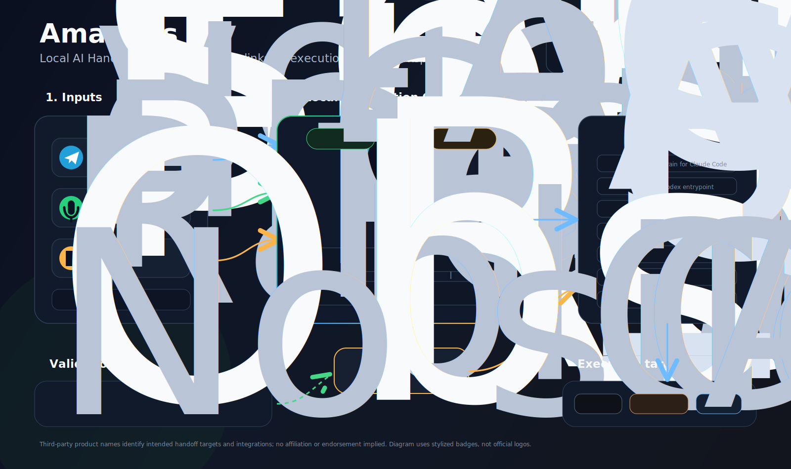

# Amadeus - Local AI Handoff Agent

Amadeus is a local AI agent that turns voice notes, Telegram messages, files, links, and rough project ideas into execution-ready handoff workspaces for Codex, Claude Code, and Antigravity.

It is closer to voice-to-context than voice-to-code: the output is not production app code, but a structured project workspace with context, prompts, source maps, decisions, and agent instructions.

Amadeus is not the final task executor. It prepares the context, detects gaps, asks targeted questions, builds the workspace, and writes the instructions for the executing agent.



Third-party product names in the diagram identify intended integrations and handoff targets; no affiliation or endorsement is implied.

## Target Architecture

Core decisions:

- Model: `gemma4:e4b`.
- Runtime: Ollama, local.
- Transcription: `faster-whisper`, local and free.
- Inputs: Telegram and desktop speechbar.
- Output: English-named handoff workspace.
- Handoff targets: Codex, Claude Code, Antigravity.

The final handoff workspace should contain:

```text
target_project/
|-- CLAUDE.md
|-- AGENTS.md
|-- MASTER_PROMPT.md
|-- PROJECT_BRIEF.md
|-- REQUIREMENTS.md
|-- DECISIONS.md
|-- NEXT_STEPS.md
|-- CONTEXT_INDEX.md
|-- SOURCE_MAP.md
|-- _context/
|-- _sources/
|-- _skills/
|-- _versions/
`-- _logs/
```

## Workflow

1. Receive raw input through Telegram or the desktop speechbar.
2. Preserve original text, audio metadata, files, and links.
3. Transcribe audio locally with `faster-whisper`.
4. Create clean transcripts without inventing missing facts.
5. Compile a professional master prompt.
6. Run gap analysis and ask targeted blocker questions.
7. Convert materials into AI-usable Markdown.
8. Build an English handoff workspace after the readiness gate passes.
9. Generate `CLAUDE.md`, `AGENTS.md`, source maps, context indexes, and next steps.
10. Hand off through files, not fragile live agent-to-agent control.

## Documentation Map

Start here:

- `CLAUDE.md`: agent brain for working on this repository.
- `AGENTS.md`: Codex-compatible working rules.
- `DOCUMENTATION_INDEX.md`: map of canonical docs, status docs, templates, and archived research.
- `PROJECT_STATUS.md`: current implementation status and known gaps.
- `dev_journey/`: project changelog, restore guide, and fallback snapshots for Amadeus itself.

Canonical blueprints:

- `AMADEUS_WORKFLOW_BLUEPRINT.md`: target workflow and handoff contract.
- `GEMMA_TO_AMADEUS_BLUEPRINT.md`: behavior architecture for turning Gemma into Amadeus.
- `REQUIREMENTS.md`: product requirements.
- `IMPLEMENTATION_ROADMAP.md`: build phases.

## Current Implementation Note

The existing Python prototype still contains older `speech_to_code`, Claude/Gemini/OpenAI, and code-generation assumptions. Those files are preserved as implementation material, but they are not the final target architecture.

Do not treat `config.yaml`, `requirements.txt`, or the current generator as canonical until the implementation roadmap refactors them.

## Legacy Research

Older local-AI and Qwen/llama.cpp notes were moved out of the root and archived under `docs/research/`. They are useful background, but they do not override the current Gemma/Ollama/faster-whisper direction.

## Dev Journey And Fallbacks

Amadeus keeps curated milestone snapshots under `dev_journey/`. Use that folder to understand major project changes, restore important documentation states, and record future implementation milestones.
