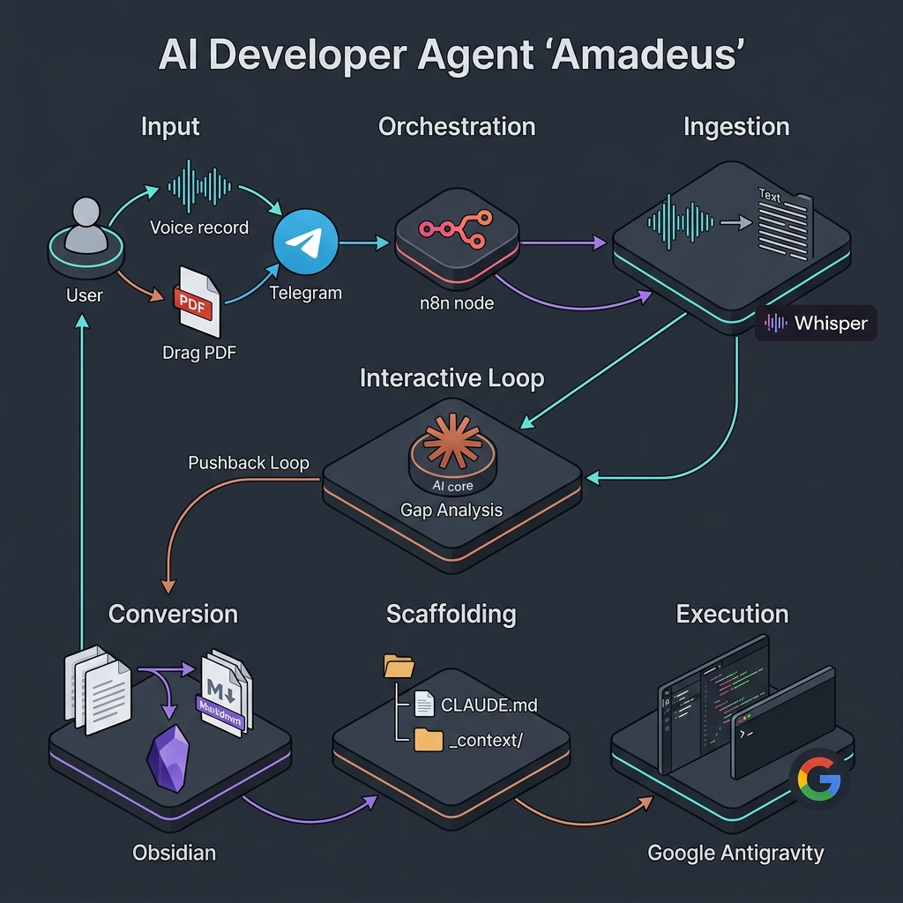

# Amadeus: Voice-to-Context Prep Agent

Amadeus ist ein autonomer Desktop-Agent, der den initialen Setup- und Prompting-Prozess für LLM-gestützte Entwicklung (speziell Claude Code in VS Code) vollständig automatisiert. Er eliminiert manuelles Prompt-Engineering und das Aufbereiten von Referenzmaterialien durch eine strukturierte Voice-to-Context-Pipeline.

## Zielsetzung

Amadeus generiert **keinen** Programmcode. Die Kernaufgabe besteht darin, unstrukturierte gesprochene Anforderungen und rohe Referenzdokumente in einen perfekt vorbereiteten, Markdown-basierten Projekt-Workspace zu übersetzen. 

Das Endprodukt ist ein Verzeichnis, das eine `CLAUDE.md` (als Master-Prompt) und einen `/_context` Ordner mit aufbereiteten Materialien enthält, sodass Claude Code ohne manuellen Overhead sofort mit der fehlerfreien Implementierung starten kann.

## Die Core-Pipeline



### 1. Ingestion & Gap Analysis
*   **Audio Capture:** Eine minimalistische Desktop-UI (Floating Bar) nimmt via Hotkey Audio in hoher Qualität auf.
*   **Transkription:** Die OpenAI Whisper API transkribiert das Audio fehlerfrei (insbesondere bei deutschen Fachtexten).
*   **Context Verification:** Der Agent prüft das Transkript gegen die bereitgestellten Zieldokumente.
*   **Pushback Loop:** Fehlen kritische Architekturentscheidungen, Constraints oder referenzierte Dateien, pausiert der Agent und fragt gezielt über das UI nach. Dieser Loop wiederholt sich, bis die Anforderungen vollständig sind.

### 2. Autonomous Deep Prep
*   **Data Conversion:** Beigefügte PDFs oder Word-Dokumente werden in reines, semantisches Markdown (`.md`) konvertiert, um die Token-Verarbeitung für das nachfolgende LLM optimal zu gestalten.
*   **Mega-Prompt Synthesis:** Alle validierten Transkripte werden aggregiert und in einen umfassenden "Mega-Prompt" übersetzt. Dieser Prompt enthält exakte Implementierungsschritte, Systemgrenzen und Erfolgskriterien.

### 3. Workspace Scaffolding
*   **Directory Initialization:** Das System generiert die physische Projekt-Ordnerstruktur.
*   **Context Segregation:** Alle konvertierten Markdown-Referenzen werden isoliert im Verzeichnis `/_context` abgelegt.
*   **Master `CLAUDE.md`:** Das finale Dokument verlinkt nativ alle Referenzdokumente und beinhaltet den Mega-Prompt. Diese Datei dient als direkter Einstiegspunkt für Claude Code.

## Architektur & Technologie-Stack

| Komponente | Technologie / Bibliothek | Verantwortung |
| :--- | :--- | :--- |
| **Audio Capture** | `sounddevice` | Blockierungsfreie Sprachaufnahme auf Systemebene. |
| **Transkription** | OpenAI Whisper API | Hochpräzises Speech-to-Text. |
| **LLM Engine** | DeepSeek-R1 (Ollama) / Groq / Anthropic | Gap Analysis, Erzeugung von Rückfragen und Synthese des Mega-Prompts. |
| **Data Parsing** | PyMuPDF, MarkItDown | Verlustfreie Konvertierung von PDF/Word in LLM-optimiertes Markdown. |
| **UI Layer** | Tkinter / PyQt (Floating Bar) | Minimalistische Desktop-Interaktion (Record, Pause, Submit). |

## Input/Output Spezifikation

**Input:**
*   Sprachaufnahmen (`.wav`, 16kHz).
*   Rohe Referenzdateien per Drag & Drop (`.pdf`, `.docx`).

**Output Struktur (Ziel-Ordner):**
```text
/ziel_projekt/
├── _context/
│   ├── referenz_dokument_1.md
│   └── referenz_dokument_2.md
└── CLAUDE.md             # Enthält den Mega-Prompt und alle Kontext-Mappings
```
